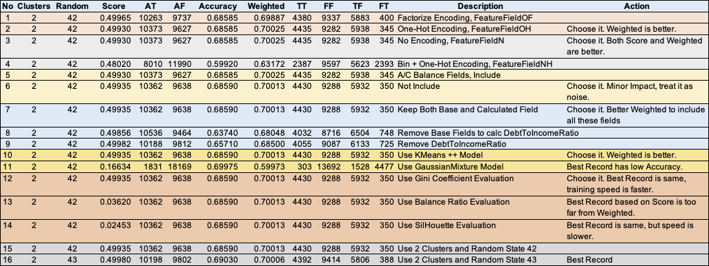

# CapStone Project Proposal for NTUC Module VLC-SCAI012-24-0652

## Project Description

### Objectives

To implement a Credit Risk Assessment Model for personal loans, it can be utilized to evaluate loan applications, determining  the approval status.

### Project Type

Machine Learning Model for Credit Risk Assessment

### Problem to address

- Periodic reassessments of borrowers' repayment capacity are costly and labor-intensive.
- Strict qualification criteria exclude potentially low-risk individuals from accessing loans.
- Some approved loans may exceed borrowers' actual needs, introducing unintended risks and potential misuse of funds.

### The motivation for why you find this project interesting

- AI combined with big data can enable faster, lower-risk, and more cost-effective credit risk assessments.
- More people will benefit from easier, faster, and cheaper access to bank loans.

### Research any previous work that you know about

None. In previous work, doesn't have any exposure to Credit Risk relevant work.

## Project Plan

1. Data understanding and preparation
2. Exploratory Data Analysis (EDA)
3. Feature Engineering
4. Model Development
5. Model Evaluation
6. Deployment
7. Conclusions and insights
   1. Summarize key finding
   2. Provide suggestions for future work.

## Datasets and its sample codes

1. [Loan.csv|20,000](https://www.kaggle.com/datasets/lorenzozoppelletto/financial-risk-for-loan-approval/data), [Code1](https://www.kaggle.com/code/lorenzozoppelletto/financial-regression-and-binary-classification), [Code2](https://www.kaggle.com/code/jayrdixit/financial-risk-loan-approval)
2. [finance_dataset.csv|10,000](https://www.kaggle.com/datasets/kushagrakashyap23/finance-dataset)
3. [P39-Financial-Data.csv|17,908](https://www.kaggle.com/datasets/shubhi13/financial-dataset), [Source2](https://www.kaggle.com/datasets/dondata/loans-data)
4. [financial_risk_assessment.csv|15,000](https://www.kaggle.com/datasets/preethamgouda/financial-risk), [Code1](https://www.kaggle.com/code/preethamgouda/sample), [Code2](https://www.kaggle.com/code/vinod123kumar/finacial-risk), [Code3](https://www.kaggle.com/code/gouravgulia/financial-risk-assesment), [Code4](https://www.kaggle.com/code/kimkijun7/financial-risk-classifier-ml-ann-with-python), [Code5](https://www.kaggle.com/code/zeyadsayedadbullah/individual-financial-risk-analysis), [Code6](https://www.kaggle.com/code/mahmoudredagamail/financial-risk)
5. [credit_score_dataset.csv|1,000,000](https://www.kaggle.com/datasets/gautam02s/financial-record)

## References

1. [Learning Source1](https://www.youtube.com/watch?v=C3l92t0WmyQ&list=PLHPuG1bQvaJGTnmTp8nbNfEzcU9dT8jKQ&index=1)

## Dataset Study

| Field | Description |
| ----------- | ----------- |
|ApplicationDate|Loan Application Date|
|Age|Age, 18-80, in Years|
|AnnualIncome|Annual Income, in $|
|CreditScore|Credit Score, Credit Bureau issue, in number, [Introduction](https://www.creditbureau.com.sg/credit-score.html), [Singapore Personal Credit Report](https://www.creditbureau.com.sg/pdf/UYCR_Updated_25_July_2024.pdf), [Additional Sample](https://www.creditbureau.com.sg/pdf/Enhanced-Consumer-Credit-Report-2022.pdf)|
|EmploymentStatus|Employment Status, Employed/Self-Employed/unemployed|
|EducationLevel|Education Level, High School/ Associate/ Bachelor/ Master/ Doctorate|
|Experience| Number of Experiences, 0-61, in Years|
|LoanAmount|Amount to apply|
|LoanDuration|Duration to apply, 12-120, in Months|
|MaritalStatus| Marital Status, Single/ Married/ Divorced/ Widowed|
|NumberOfDependents|Number of Dependents, 0-5|
|HomeOwnershipStatus|Home Ownership, Own/ Mortgage/ Rent/ Other|
|MonthlyDebtPayments|Monthly Debt Payments|
|CreditCardUtilizationRate|Credit Card Utilization Rate|
|NumberOfOpenCreditLines|Number of Open Credit Line, 0-13, [Source](https://www.investopedia.com/terms/l/lineofcredit.asp)|
|NumberOfCreditInquiries|Number of Inquiries to Credit, 0-7, [Source](https://www.experian.com/blogs/ask-experian/how-many-hard-inquiries-is-too-many/)|
|DebtToIncomeRatio|??, Suspected it is wrongly Created, assume it is TotalDebtToIncomeRatio, ignore it|
|BankruptcyHistory|Bankrupted before(1) or not(0)|
|LoanPurpose|Loan Purpose, Home/ Auto/ Education/ Debt Consolidation/ Other|
|PreviousLoanDefaults|Default before(1) or not(0)|
|PaymentHistory|8-45, in Month?, logic is inconsistent in manual algorithm, ignore it|
|LengthOfCreditHistory|1-29, in Year?|
|SavingsAccountBalance|Saving Amount|
|CheckingAccountBalance|Cheque Amount|
|TotalAssets|Total Assets Value|
|TotalLiabilities|Total Liabilities Value|
|MonthlyIncome|= Annual Income / 12|
|UtilityBillsPaymentHistory|?? not used in manual algorithm, ignore it|
|JobTenure|how long to work in current job, 0-16, in years|
|NetWorth|= Total Assets - Total Liabilities|
|BaseInterestRate|Starting Interest Rate|
|InterestRate|Applied Interest Rate|
|MonthlyLoanPayment|= Mortgage Calculation based on InterestRate, LoanAmount and LoanDuration, [Calculator](https://www.calculator.net/mortgage-calculator.html)|
|TotalDebtToIncomeRatio|= (MonthlyDebtPayments + MonthlyLoanPayment) / MonthlyIncome|
|LoanApproved|Loan Approved(1) or Rejected(0)|
|RiskScore|Risk Score, [Credit Score to Credit Risk Assessment](https://www.fibe.in/blogs/credit-score-vs-credit-risk-assessment-whats-the-difference/)|

## Model Training

### Preprocessing

1. Cleaning, missing, outlier, noise reduction
   1. DebtToIncomeRatio problem was identified during feature engineering. the training data was regenerated by the fixed [Code](CSV-Generation.py) into the [Loan2.csv](Loan2.csv).
2. Transformation,
   1. standardize data type
   2. feature Engineering(new/change current feature)
   3. categorize encoding(One-Hot, Bin)
3. Balancing, to ensure different pattern of data has balance/enough records, the testing data is well balanced
4. Feature Selection, to rank the importance of features. and pick features that impact training most.

### Tuning Journey

- All Original fields
- Convert all numbers to float64.
- Convert Binary Field to Boolean Field
- One-Hot Mapping or Factorize for all Object Feature Fields
- Convert Number Field to Bin, and convert Bin into One-Hot, negative impact to result
- Identify fields which are no impact
- Identify based fields and calculated field.
- Choose ML model Gaussian Mixture or KMeans
- To evaluate metric function for score calculation
- To evaluate accuracy function for model performance comparison.
- To try different hyper parameters, like number of Clusters and Random State

all the tunning journey are recorded in the test result.

### Save the trained model into files

The model must include both [model file](credit-risk-model.joblib) and [scaler file](credit-risk-scaler.joblib). If scaler file is not included together, prediction will be out due to the features are not scaled using same scaler.

## Loan Application Approve/Reject Prediction

After loaded both model and scaler files, the new [load application](Loan2-applicationl.csv) file is used for prediction.

The prediction result is saved in the [application result](Loan2-application-result.csv) file.
